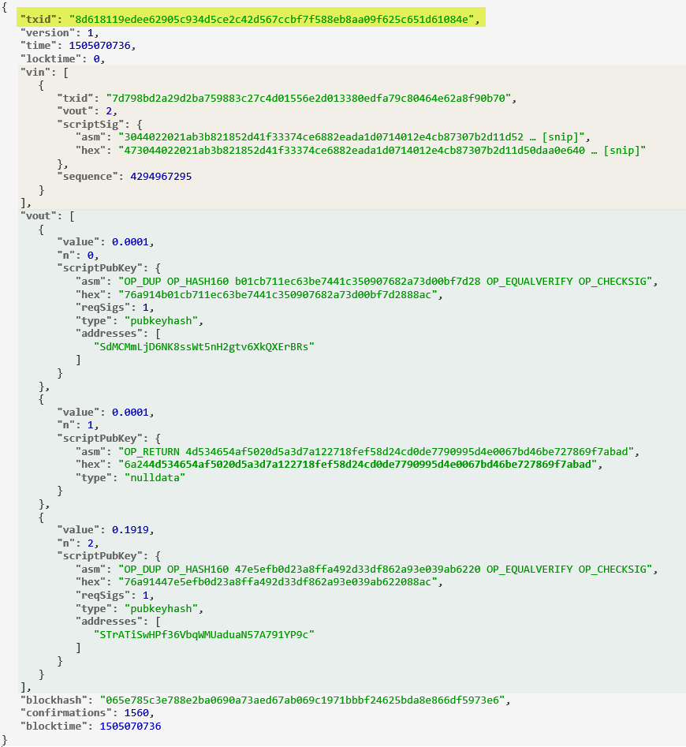
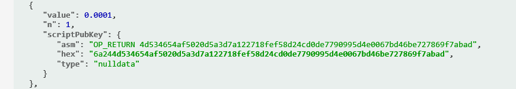
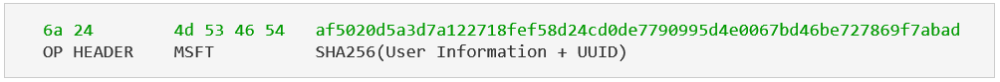
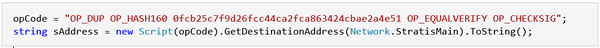
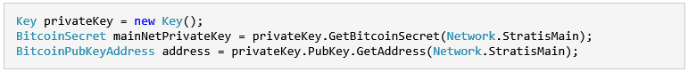

## **Stratis Identity Module**

With the Stratis **Identity** module we have created a blockchain identity management solution; a real-world use case for the Stratis Blockchain. The module is implemented using C# with the application&#39;s backend deployed on Microsoft Azure. The mobile application has been developed using Visual Studio and Xamarin. This example can be used as a reference to build similar applications based on the Stratis Blockchain. The application will help to demonstrate the process of blockchain based development. Educating developers on the basics for typical cryptographic use in practical blockchain solutions and applications.

**We will be updating this page throughout the coming weeks, so we advise to check in regularly for the latest information.**

## **What is a Stratis transaction used with the Identity Application?**

A Stratis transaction is a signed piece of data that is broadcast to the network and if valid, is written to a block on the blockchain.

When you send Stratis, a single data structure (transaction) is created by the C# client and then broadcast to the network. Stratis nodes on the network will relay and rebroadcast the transaction, and if the transaction is valid, nodes will include it in the block they are &quot;mining&quot;. Usually, within 1-2 minutes the new transaction will be included in a new block in the blockchain. At this point the user is able to see the transaction (attestation) in the blockchain.

## **Stratis Identity transaction**

Here is an example of a Stratis transaction used with the Identity module that was included in the blockchain earlier this year.

The main components of the standard transaction are:

1- Transaction ID (highlighted in yellow)

2- Descriptors and meta-data

      version: tx version format; currently at version 1

      lock_time: should be 0 or in the past for the tx to be valid and included in a block

3- Inputs (light orange area)

4- Outputs (green area)

## **What is an attestation using your Social Provider?**

The information obtained from the Social Provider (Microsoft, Google, LinkedIn) is used as a witness for the information the user has registered with each of them. Attestation with multiple providers where the information matches between them, will increase the level of trust the system has for the user.

## **Attestation Signature**

A cryptographic hash (sometimes called &#39;digest&#39;) is a kind of &#39;signature&#39; for a text or a data file. SHA256 used generates a unique 256-bit (32-byte) signature for a text.

A cryptographic hash is created with the user information concatenated with a UUID (Universal Unique Identifier) that is a 128-bit number and this hash is written into the Stratis Blockchain.

Adding the UUID at the end of the user&#39;s information is a technique called salting, which makes it impossible to use lookup tables and rainbow tables to crack a hash. Thereby increasing the security (even if there was any doubt concerning the use of SHA256). The consequence is that two users with identical information will have a different hash in the Blockchain. We at Stratis take security very serious.

The following is an example on how the hash is created. The character used to separate the fields is &quot;|&quot; (vertical bar or pipe):

        Name|email|UUID

Sato Naka|nakamoto.sata@outlook.com|1760eea9-2a86-43d1-9ec2-80149f315776

   SHA256 --&gt; af5020d5a3d7a122718fef58d24cd0de7790995d4e0067bd46be727869f7abad

You can verify or create the SHA256 with any program or from online sites like:

         http://www.xorbin.com/tools/sha256-hash-calculator

In this example, Satoshi&#39;s Stratis Identity is **SdMCMmLjD6NK8ssWt5nH2gtv6XkQXErBRs** and you can verify its attestations on the Stratis Blockchain:

         https://chainz.cryptoid.info/strat/address.dws?SdMCMmLjD6NK8ssWt5nH2gtv6XkQXErBRs.htm

For Satoshi&#39;s blockchain transactions (attestations) in the link above, one of the transaction&#39;s outputs is the OP\_RETURN (Script Instruction). The OP\_RETURN let you add up to 40 bytes of data to each blockchain transaction. This is Satoshi&#39;s attestation with Microsoft:

         https://chainz.cryptoid.info/strat/tx.dws?1242161.htm

A breakdown for the attestation part of this transaction:

Another alternative to format the way the user information is being hashed, is to use Netstring. See this link for more detail  (https://en.wikipedia.org/wiki/Netstring).

For the example above, the attestation string using Netstring format would look like this:

         <9>Sato Naka<25>nakamoto.sata@outlook.com<36>1760eea9-2a86-43d1-9ec2-80149f315776

Where the numbers between &lt;&gt; are decimal numbers corresponding to the number of ASCII characters for each field. You can allocate 1-2 hexadecimals or use decimals - however ensure the format is consistent.

## **What makes transactions different?**

A user can send identical information to another user&#39;s blockchain address, however this will still be treated as a unique transaction. As only Stratis Identity is able to &quot;sign&quot; these transactions. When a transaction is sent, the private key is applied to the sender&#39;s address (public key). Its signature on the transaction indicate the coins are coming from **STrATiSwHPf36VbqWMUaduaN57A791YP9c**, and only Stratis has the Private Keys able to send it.

The task to identify the unspent transaction output (or UTXO) within a transaction that corresponds to the Stratis Identity address **(STrATiSwHPf36VbqWMUaduaN57A791YP9c)** would ordinarily be difficult. But with the use of the Stratis framework **NStratis,** it is achieved with one line of code.

## **Summary of how a Stratis Identity Transaction works**

An important part of any transaction is the output. This typically represents an amount that was sent to a Stratis address, along with a set of rules to unlock the output amount. In Stratis jargon an output is sometimes also referred to as the UTXO (unspent transaction output).

A standard transaction output can be unlocked with the private key associated with the receiving address.

It is vital to use the UTXO that is under the user&#39;s control, which may sound trivial. However it is important to look where the UTXO is located in the previous transaction in order to build the new transaction.

Another type of output is the attestation hash for the Social Provider in the transaction. This combined with the knowledge that the transaction is being sent from **STrATiSwHPf36VbqWMUaduaN57A791YP9c** (to the user Identity address) complete the &quot;Identity Signature&quot; for the attestation transaction

## **Attestation code to the Stratis Blockchain**

You will hopefully now have an understanding about how the Stratis Blockchain is being used in a real application like the Stratis **Identity** Module. You can apply the same concepts and code to your project. Be sure to have installed the **NStratis** package prior to running the code.

Create your own set of keys (private and public) and replace the values on the code:

Here the [link](./src/StratisID.WebApi/TransactionManager.cs) to the code

An important consideration to scale to production environment a project like this, is not to use the same address for multiple transactions (Address reuse). In this module, the change address used is the same sending address, and the Public Key is being exposed and not the hash. See this link for more details (https://en.bitcoin.it/wiki/Address\_reuse)

## **Open Source Stratis Identity**

The entire Stratis **Identity** project will be released as an open source for developers and blockchain enthusiasts to learn how to create their own Stratis Blockchain applications from scratch. The code uses C# and Xamarin for the Mobile App. The below Azure Resources are also used:

- Microsoft Azure AD B2C
- Microsoft Azure Active Directory Graph API
- Microsoft WebApp
- Microsoft SQL Server
- Microsoft Applications Insights
- Microsoft Visual Studio Team Service (Agile/Scrum used for the project)
- Virtual Machine with the Stratis Blockchain node

We will be providing periodic updates to this page, with more code to come!

## **Technologies used by the Stratis Identity**

Blockchain technology give us a wide range of possibilities to work with - one of them being identity management. The idea in this case is to use the blockchain as a solution to tackle the problem of identity verification and identity theft - by using integrations with several identity providers. Here is a technical explanation on how you can do that with Stratis blockchain technology and Microsoft technologies.

## **Integrating with Identity Providers using Azure AD B2C Service**

Azure Active Directory B2C is a service that allows you to connect with customer identities through several identity providers like Google, Facebook, LinkedIn, amongst others. This service gives a developer the facility to get basic user information from several providers in a simple way, configuring them in the Azure portal. You can find more documentation here:

[https://docs.microsoft.com/en-us/azure/active-directory-b2c/](https://docs.microsoft.com/en-us/azure/active-directory-b2c/)

## **Getting customer info synced in Azure Active Directory using Azure AD Graph API**

When a customer signs in through the Azure AD B2C service, their basic information is synced with the Azure Active Directory (AD). Here you can query the Azure AD in order to get the information from any user using the Graph API.  You can find the entire documentation set for this service here:

[https://docs.microsoft.com/en-us/azure/active-directory/develop/active-directory-graph-api-quickstart](https://docs.microsoft.com/en-us/azure/active-directory/develop/active-directory-graph-api-quickstart)

## **Using Microsoft technologies to create the App**

Microsoft gives a complete stack of technologies to complement the identity application. This example used many Microsoft frameworks and technologies to create a Web API and Mobile Application. There are many options to select in terms of technologies, and you can choose the ones with which you feel most comfortable. Even if you are unfamiliar with these technologies we strongly recommend you that you give it a try, as they are an excellent starting point.

## **Web API with ASP.NET Core**

Microsoft recently rebuilt from scratch its Web Framework ASP.NET and called it **ASP.NET Core**.  This is a highly recommended way to create web apps focused on performance and simplicity. The Stratis Identity Module uses a Web API created with this very framework. You can find the complete ASP.NET Core documentation set here:

[https://docs.microsoft.com/en-us/aspnet/core/tutorials/first-web-api](https://docs.microsoft.com/en-us/aspnet/core/tutorials/first-web-api)

## **Building our mobile app with Xamarin**

Xamarin was acquired by Microsoft in order to expand their mobile services strategy. Xamarin enables developers to build mobile apps using C# and F#. Delivering fully native mobile app experiences to all major devices - including IOS, Android and Windows. It provides a whole stack of technologies that enable developers to create great mobile apps. You can get more information on Xamarin here:

[https://developer.xamarin.com/guides/cross-platform/getting\_started/](https://developer.xamarin.com/guides/cross-platform/getting_started/)

## **Instrumenting your apps with Application Insights**

You have finished building your app and will likely wish to monitor for crashes and any unwanted behavior. A very useful service called Application Insights allows you to detect performance abnormalities and unexpected errors. You don&#39;t need to be testing a full Microsoft technology stack based application to use it. It can be used in a wide variety of platforms including .NET, Node.js and J2EE. Below is a link where there are more details.

[https://docs.microsoft.com/en-us/azure/application-insights/app-insights-overview](https://docs.microsoft.com/en-us/azure/application-insights/app-insights-overview)